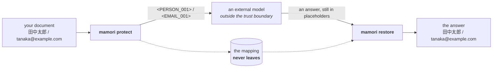

# mamori 守り

**Use real data with an external LLM, without sending real data to it.**

日本語版は [README.ja.md](README.ja.md)、中文版在 [README.zh.md](README.zh.md)。

You have a customer email in front of you and a model that could draft the
reply in seconds. So you retype the message with the names removed, get the
placeholders inconsistent, miss the phone number in the signature, and end up
with a worse draft than if you had written it yourself.

`mamori` does that step for you, locally and consistently.

```text
you write                      the model sees                 you get back
─────────────────────────────  ─────────────────────────────  ─────────────────────────────
田中太郎さんへ                  <PERSON_001>さんへ              田中太郎さんへ
tanaka@example.com から        <EMAIL_001> から                tanaka@example.com から
メールが届きました。            メールが届きました。             メールが届きました。
```

The mapping from `<PERSON_001>` back to `田中太郎` never leaves your machine.

**mamori is a place values pass through, not a place they are kept.** It is not
encryption and not access control: it sits at the last moment before text
leaves for a service you do not control, and at the first moment the answer
comes back.



Everything on the left of the model is local, deterministic, and testable
without a network. The model never receives a value and is never asked to
decide anything about one.


| | |
|---|---|
| **[See it work](#see-it-work)** | five scenarios, and one against a real model |
| [Install](#install) · [Use](#use) | the library, streaming, the shell |
| **[Without changing your application](#without-changing-your-application)** | the proxy: change `base_url`, change nothing else |
| [Languages](#languages) | Japanese, English and Chinese, in one document |
| [Switching things](#switching-things) | settings, and the recall dial |
| [When it gets something wrong](#when-it-gets-something-wrong) | corrections: your last word |
| [Readable values](#readable-values-instead-of-tokens) | surrogates, and why they are off by default |
| [Why was this replaced?](#why-was-this-replaced-why-was-that-not) | and why was that **not** |
| **[What is this doing with my data?](#what-is-this-actually-doing-with-my-data)** | answered from your own configuration |
| [Wiring up a model](#wiring-up-a-model-wherever-it-runs) | on this machine or on your network |
| [Prompts](#prompts) · [The hard parts](#the-three-things-that-make-this-hard) | what the model is told, and why this is difficult |
| **[How well does it work?](#how-well-does-it-work)** | the numbers, at two scales |
| [What this does not do](#what-this-does-not-do) · [Design](#design) · [Roadmap](#roadmap) | the limits, and the plan |

---

## See it work

Nothing to configure:

```bash
pip install git+https://github.com/Nananananana/mamori.git
mamori demo
```

Five short scenarios, each answering a question somebody actually has: what the
model sees and whether you get your words back, what happens when a placeholder
arrives split across streamed chunks, whether any of this survives a document
rather than a sentence, what to do when it gets one wrong, and what happens when
there is a password in your text.

Then try it on something of yours:

```bash
mamori demo --file draft.txt
mamori demo --scenario roundtrip --text "Call Jane Doe on 415-555-0198"
```

```text
you wrote
  Dear Jane Doe, reach me at jane.doe@example.com

the model sees
  Dear <PERSON_001>, reach me at <EMAIL_001>

replaced 2 value(s), and what found each one:
  <PERSON_001>        PERSON        en          0.90
  <EMAIL_001>         EMAIL         universal   1.00
```

The last two columns are the rule set that fired and how sure it was, so "why
was this replaced?" has an answer.

### Against a real model

`--live` protects your text, sends it to a model you name, and restores the
answer — the whole round trip, with nothing simulated:

```bash
mamori demo --live --model llama3.1:8b --api http://localhost:11434/v1/ \
  --text "田中太郎さんへ。tanaka@example.com までご返信ください。3行で要約して。"
```

```text
what actually goes over the wire
  <PERSON_001>さんへ。<EMAIL_001> までご返信ください。3行で要約して。

what the model said (placeholders intact)
  <PERSON_001>さまへ
  <COMPANY_NAME_001>からご連絡いたします。

restored into your own words
  田中太郎さまへ
  株式会社さくら商事からご連絡いたします。
```

It works with any OpenAI-compatible endpoint — Ollama, vLLM, LM Studio, or a
hosted API with `--api-key-env`.

---

## Install

**Not on PyPI yet.** Install from the repository:

```bash
pip install git+https://github.com/Nananananana/mamori.git
```

`pip install mamori` is what this section said for twenty-five releases, and it
has never once worked: there is no package under that name on PyPI, and this
project has never had a job that would publish one. A sibling depending on
`mamori>=0.14` had a CI step that could not install it, wrapped in
`continue-on-error`, so the seam it was supposed to cover had never run and
nothing had gone red. The instruction was found by somebody checking it rather
than reading it.

Releases are tagged, so a specific version works too:

```bash
pip install git+https://github.com/Nananananana/mamori.git@v0.29.0
```

No model, no GPU, no network. The default detectors are pattern rules that run
in microseconds.

---

## Use

```python
import mamori

with mamori.PrivacySession() as session:
    protected = session.protect("田中太郎さんに tanaka@example.com で連絡して")
    # -> '<PERSON_001>さんに <EMAIL_001> で連絡して'

    answer = call_your_favourite_llm(protected.protected_text)

    print(session.restore(answer).text)
```

A session is one conversation. The same value keeps the same placeholder for
its whole life, so a model can tell that two mentions are the same person, and
an answer in turn five can still be restored with a value from turn one.

### Streaming

An answer arrives token by token, and `<PERSON_001>` shows up as `<PER`,
`SON_0`, `01>`. Restore it as it comes:

```python
stream = session.stream_restore()
for chunk in llm_response_stream:
    print(stream.feed(chunk), end="", flush=True)
print(stream.finish())
```

Whatever the chunking, this emits exactly what `restore()` would emit for the
whole response — checked with Hypothesis over every split, because a streaming
path that *usually* agrees with the batch path breaks at whichever token
boundary the model happens to pick.

### From the shell

```bash
mamori inspect -f draft.txt
```

```text
4 detected:
      0:4     PERSON           <PERSON_001>       田***                (ja, 0.90)
     12:30    EMAIL            <EMAIL_001>        t*****************   (universal, 1.00)
     45:58    PHONE            <PHONE_001>        0************        (ja, 0.90)
     70:94    INTERNAL_URL     <INTERNAL_URL_001> h***********************  (universal, 0.90)
```

The last column is the rule set that fired, so you can see which language's
pack found what.

`mamori demo` runs a whole round trip, including a reply whose placeholders
have been mangled, so you can see what recovery looks like.

---

## Without changing your application

Nobody rewrites a working application to adopt a library. If yours already
talks to an OpenAI-compatible API, put mamori in front of it and change one
string:

```bash
mamori serve --upstream https://api.openai.com/v1/
```

```text
mamori proxy on http://127.0.0.1:8100/v1/
  upstream        https://api.openai.com/v1/
  detection       all locales, recall_first
  briefing        prepended
```

Point the application at `http://127.0.0.1:8100/v1/` and nothing else changes.
Every message is protected on the way out, the reply is restored on the way
back, and the proxy logs what it replaced without ever logging a value:

```text
  1 message(s), replaced EMAILx1, PERSONx1, PHONEx1
```

Streaming works: a placeholder arriving as `<PER`, `SON_0`, `01>` is held and
restored as it passes. A blocked credential stops the request instead of
forwarding it. It binds to this machine only unless you say otherwise, because
anything that can reach the port can send documents through it. See
[ADR 0018](docs/adr/0018-a-proxy-on-the-standard-library.md).

### Turn two

By default the proxy holds nothing between requests: one scope, used once,
purged with the reply. For most clients that is invisible, because they resend
the whole conversation each turn and the same values land on the same
placeholders — a claim that is now a test rather than a paragraph.

It breaks for a client whose history lives on the service side and sends only
the new turn. The service answers about `<PERSON_001>`, this process has never
heard of `<PERSON_001>`, and a token is printed at a human:

```bash
mamori serve --conversations --upstream https://api.openai.com/v1/
```

The reply carries `X-Mamori-Session`. A client that echoes it keeps its
placeholders across turns; one that does not gets a fresh scope, exactly as
before. **The token is minted by the server and never taken from the caller**
— the thing behind it is a table of real values, and an identifier an outsider
can guess is a way to read somebody else's table. An unrecognised token quietly
starts a new conversation rather than reporting that it was unrecognised.

Conversations expire after 30 minutes idle and 64 are held at most; both bounds
purge what they drop, and nothing is ever written to disk. Watch it happen:

```bash
mamori demo --scenario conversation
```

See [ADR 0028](docs/adr/0028-the-server-names-the-conversation.md).

---

## A prompt nobody typed

More and more prompts are not written, they are **assembled** — a retrieval
layer picks passages out of your notes, puts the file each came from in a
header, and renders the lot. Three kinds of thing end up in one document and
they are not the same kind:

```text
[fbd4c2a631fd] /home/p.doe/notes/meeting-log.md (Meeting)[464:562]
Met with Priya Raman from Northwind Ltd on Tuesday.
```

```text
[fbd4c2a631fd] /home/<PERSON_001>/notes/meeting-log.md (Meeting)[464:562]
Met with <PERSON_002> from <COMPANY_NAME_001> on Tuesday.
```

**The header names a person.** A home directory identifies its owner as surely
as a signature block does, and that name is often nowhere else in the document.
Only the one segment is replaced: the rest of the path is provenance, and
something downstream may be checking it. System accounts — `runner`, `Public`,
`www-data` — are refused from a closed list.

**The structure is not touched.** `[fbd4c2a631fd]`, `[464:562]`,
`//fileserver/team/`. Over-redacting a word costs answer quality; over-redacting
a content hash produces a package whose id no longer verifies, which downstream
is indistinguishable from one somebody tampered with. In the bundled datasets
these are labelled as ordinary text, so anything replaced there fails a test.

**A quotation comes back exactly.** If something is checking the model's
citations against what was sent, restoration has to be character-for-character:
one character of drift reads as a fabricated quote rather than a redacted one.
Three hundred generated answers, all three hundred exact.

```python
result = session.protect(package)
result.reversible  # False if anything was masked rather than replaced
result.masked_types  # ('PHONE',) — types, never values
```

`<PERSON_001>` and `[REDACTED]` look equally replaced in the text, and only one
of them can be undone. Anything verifying claims needs that as data, because it
is the difference between *unsupported* and *unverifiable*.

```bash
mamori demo --scenario package
```

This was measured against [tsumugi](https://github.com/Nananananana/tsumugi),
which renders exactly this shape and checks the citations afterwards. Neither
project depends on the other. See
[ADR 0029](docs/adr/0029-a-prompt-nobody-typed.md).

---

## An agent, not a chat

By the time an application is an agent, most of the personal data has left the
prose. It is in the arguments of a tool call:

```json
{"to": "jane.doe@example.com", "employee_id": "E-45033",
 "body": "Dear Jane Doe, call 415-555-0198."}
```

Four values, one call. `mamori serve` protects all of them and puts them back
when the model calls the tool:

```json
{"to": "<EMAIL_001>", "employee_id": "<EMPLOYEE_ID_001>",
 "body": "Dear <PERSON_002>, call <PHONE_001>."}
```

**In a payload the label is a key.** `"employee_id"` says what the value is as
plainly as `Employee ID:` does in a sentence, and there is no prose around it
to give a rule a second chance. Seven key families are read, in English,
Japanese and Chinese spellings. A bare `"name"` is deliberately not one of
them: in JSON that is a tool name far more often than a person, and redacting
the name of the function an agent is calling breaks the call.

**The structure is a negative set.** `send_email`, `call_0042`, the JSON
schema, the enum — untouched, and pinned by tests. If protection ever produced
arguments that no longer parse, the request is refused rather than forwarded:
a leak is visible, and a payload that breaks in somebody else's process three
hours later is not.

**And it comes back.** A model that answers with a tool call rather than a
sentence has its arguments restored too — including in a stream, where each
call is its own run of text. Without that the application emails
`<EMAIL_001>`, which is the failure that looks like a bug rather than a leak.

```bash
mamori demo --scenario agent
```

Also fixed in `v0.18`: one kana character used to stand the Chinese rules down
for a whole document, so a payload with a Japanese subject and a Chinese body
sent the body in the clear. Evidence about a script now reaches to the end of
its sentence and no further. See
[ADR 0030](docs/adr/0030-a-tool-call-is-text.md).

---

## Deploying it

Three things a team needs before this goes near production, and none of
them is a detection rule.

### Before it is committed

The values that reach a model through a *repository* never pass through this
library at all. A prompt template with a real address in it, a fixture built
from a support ticket, a notebook whose output cell still holds the query that
produced it.

```bash
mamori lint
```

```text
prompts/renewal.md:14: PERSON (0.90, en) J*******
prompts/renewal.md:14: EMAIL (1.00, universal) j**********@e******.com
fixtures/ticket.json:3: PHONE (0.90, en) 4***********

3 finding(s) in 2 file(s); 0 credential(s).
```

**It never prints a value.** These outputs land in CI logs, which are archived,
searchable and often more widely readable than the repository itself.

**It fails on credentials and reports the rest.** A leaked key is an incident.
A customer's name in a fixture is a decision somebody should make on purpose,
and a linter that exits non-zero for both teaches people to pass `--no-verify`.
`--fail-on any` is there for a repository that has made the other decision.

Pointed at this repository's own documentation, it found a bug on the first
run: a GitHub URL is a long run of exactly the characters a base64 key is made
of, and the wide secret rule was reporting one as a credential.

### When you would rather be stopped

The default resolves doubt in favour of sending: a detection below
`min_confidence` is discarded, and the text goes out with the value in it. For
a legal team, a clinical setting, anywhere the cost of a leak is not measured
in answer quality:

```python
MamoriConfig(min_confidence=0.85, uncertain="refuse")
```

```text
PolicyViolationError: 1 detection(s) below the confidence threshold and this
policy refuses rather than discards them (closest 0.50); nothing sent
```

Types and confidences, never values. It does nothing at the default
`min_confidence` of `0.0`, because nothing is below zero — the two settings are
one dial, and this is the half that says what happens where certainty runs out.

### A placeholder that is not a tag

`<PERSON_001>` inside an HTML document is an unknown element: a browser drops
it, and a model asked to edit the document is being shown a tag rather than a
token.

```python
MamoriConfig(placeholder_style="square")  # [PERSON_001]
```

Restoration accepts every form whatever this is set to, so a document protected
in one style restores through a session configured for another. A placeholder's
identity is its `(type, index)` pair; the brackets are surface.

---

## Languages

Japanese, English and Chinese, in one document if that is what you have:

```text
田中太郎さんへ                        ->  <PERSON_001>さんへ
CC: Mr. John Smith (Acme Inc.)       ->  CC: Mr. <PERSON_003> (<COMPANY_NAME_002>)
张伟先生，请拨打 13812345678          ->  <PERSON_004>先生，请拨打 <PHONE_003>
```

Rules are grouped into language packs, and a pack runs when the text gives a
reason to run it. All of them are enabled by default — an unexpected language in
a document is exactly the case nobody redacted by hand — and `locales=` narrows
it when you know better:

```python
mamori.PrivacySession(locales=["ja", "en"])
```

```bash
mamori locales
```

```text
  en  English     16 rules  runs on: latin
  ja  Japanese    11 rules  runs on: han, kana
  zh  Chinese     11 rules  runs on: han  (not when: kana)
```

That last line is the whole trick. Chinese and Japanese share Han characters, so
the two surname lists fire on each other's text and turn ordinary words into
people. Kana settle it: they appear in Japanese and never in Chinese, so kana in
the text stands the Chinese rules down. Text in Han alone could be either, so
both run and over-detect — the safe direction.

Email, credentials, card numbers and private addresses are language-independent
and always run. Adding a language is one module and one registry entry; see
`register_locale`.

---

## Switching things

Detection is a pipeline of passes, not a fixed procedure. Each pass sees the
text and what earlier passes found:

```text
rules            universal patterns + whichever language packs apply
  ↓
co-occurrence    values confirmed above the seed threshold, found again
                 wherever else they appear in the same text
```

The second pass is why the first is not enough. Once a name is settled by an
honorific in one sentence, every other mention of it is the same person — and no
rule looking at those mentions alone can tell:

```text
尊敬的张伟先生：              ← an honorific settles it
本次评审由张伟主持。           ← nothing here says this is a name
请张伟在周五前回复。           ← nor here
```

All three are protected. In Chinese this is not an optimisation; there is
nothing else to anchor on.

Everything switchable lives on one object:

```python
mamori.PrivacySession(
    config=mamori.MamoriConfig(
        locales=["ja", "en"],
        min_confidence=0.7,  # ignore shaky detections: fewer placeholders, less coverage
        co_occurrence=True,
    )
)
```

`MamoriConfig` has no opinion about file formats. `from_mapping()` takes an
already-parsed mapping, so you pick JSON, TOML, YAML or a dict literal and keep
your parser to yourself — the library still has no runtime dependencies.

```bash
mamori config                       # what would be used, and where each layer came from
mamori protect --min-confidence 0.7 -f draft.txt
```

Settings layer, later winning: defaults, `--config`, `MAMORI_*` environment
variables, then flags. Unknown keys are refused rather than ignored — a typo in
a privacy setting that silently does nothing is the worst available outcome.

### The recall dial

Every rule declares a tier. **Core** rules are anchored on something rarely
anything else: a checksum, a vendor prefix, an honorific, a label. **Wide** rules
match on shape alone — ten bare digits, two capitalised words, a long
random-looking token. The stance decides which run, and **recall-first is the
default**:

| | leak rate | | over-redaction | |
|---|---|---|---|---|
| | balanced | **recall-first** | balanced | **recall-first** |
| `ja-core` | 0.68% | **0.00%** | 0.62% | **2.78%** |
| `en-core` | 1.93% | **0.64%** | 0.00% | **0.72%** |
| `zh-core` | 0.00% | **0.00%** | 1.63% | **2.94%** |
| `ja-docs` | 0.33% | **0.33%** | 0.18% | **1.06%** |
| `en-docs` | 20.02% | **3.50%** | 0.03% | **0.90%** |
| `zh-docs` | 2.37% | **2.37%** | 0.40% | **1.20%** |
| `ja-context` | 0.00% | **0.00%** | 0.00% | **0.00%** |
| `en-context` | 46.85% | **6.31%** | 0.00% | **0.92%** |
| `zh-context` | 0.00% | **0.00%** | 0.00% | **0.53%** |
| `ja-agent` | 0.00% | **0.00%** | 0.00% | **0.00%** |
| `en-agent` | 0.00% | **0.00%** | 0.00% | **0.00%** |
| `zh-agent` | 0.00% | **0.00%** | 0.00% | **0.00%** |

The `-docs` rows are the ones to read. They are business documents at the
length people actually send; the `-core` rows are sentence fragments with a
median length of 44 characters, and every number this project published before
`v0.9` came from those alone.

**`en-docs` at the balanced stance leaks 20.02%** — a fifth of the sensitive
characters — because a document is full of names with nothing anchored beside
them: in an attendee list, under a sign-off, after "Reported by:". That is the
clearest reason recall-first is the default, and the clearest argument against
turning it off before measuring your own text. See
[ADR 0025](docs/adr/0025-measure-at-the-length-people-send.md).

That is the trade, stated rather than buried. A miss is silent and permanent; a
false positive is a word visibly replaced that should not have been. Somebody
reading a protected prompt notices the second. Nobody notices the first.

```bash
mamori protect --stance balanced -f draft.txt   # fewer stray placeholders
mamori eval --stance balanced                   # measure either one
```

The stance changes no security decision — policy still decides what leaves,
resolution still picks one detection per character, credentials are still
blocked. It only proposes more, which is why "recall-first never leaks more than
balanced" is a test rather than a hope.

---

## When it gets something wrong

It will. A salutation anchor is right far more often than it is wrong, and
`Dear Monday,` is when it is wrong. Say so:

```bash
mamori correct Monday --never --note "a weekday, not a name"
mamori correct Acme   --always COMPANY_NAME --note "trading name, no suffix"
```

The second closes a gap documented since `v0.1` — a trading name with no legal
suffix, which no pattern can reach in general and any operator can settle for
their own data.

The log is append-only and the latest word about a value wins, so undo is
another correction and nothing is deleted. Rules are not rewritten and prompts
are not edited; remove the log and you are exactly back where you were.

```bash
mamori corrections     # what has been ruled on, and what it costs
```

**`--never` is the only thing in mamori that reduces what it protects**, so it
is kept narrow. Every exclusion is named by `mamori privacy` and reported as a
warning with a non-zero exit status, so a deployment check can fail on one
nobody meant to ship. And a credential can never be ruled away:

```text
error: that value looks like a credential (API_KEY), and a credential cannot
be ruled 'never'. Nothing was written -- recording it would have put the
credential in a file on disk. Rotate it instead.
```

That refusal happens *before* anything is appended, in three independent
places. See [ADR 0024](docs/adr/0024-corrections-are-appended-applied-at-read.md).

---

## Readable values instead of tokens

Some models reason badly about a page of `<PERSON_001>`. Substituting a
readable value usually gets a better answer:

```json
{"surrogates": ["PERSON", "EMAIL", "PHONE"]}
```

```text
you wrote   Dear Jane Doe, reach me at jane.doe@example.com or 415-555-0198.
sent        Dear Alex Rivera, reach me at a.person@example.com or 415-555-0142.
restored    Dear Jane Doe, reach me at jane.doe@example.com or 415-555-0198.
```

The address and the number come from ranges reserved for documentation
(RFC 2606, the 555-01xx block), so one that escapes means nothing anywhere.
**Nothing is reserved for personal names**, and that is the risk that stays.

It is **off by default**, and the reason is worth understanding before turning
it on. An unrestored `<PERSON_001>` is obvious. An unrestored `Alex Rivera` is
a sentence about the wrong person, and nobody notices. A placeholder can be
recognised by its shape, so restoration copes with a model that mangles one; a
surrogate is just a name, so it either matches or it does not.

What mamori can do is tell you. `RestorationResult.missing` lists everything
that did not come back — check it on every answer — and `mamori privacy` warns
whenever surrogates are on, naming which pools are reserved and which are
merely invented.

```bash
mamori demo --scenario surrogates
```

See [ADR 0026](docs/adr/0026-surrogates-trade-obviousness-for-readability.md).

---

## Why was this replaced? Why was that not?

```bash
mamori trace "Dear Monday, the contract is with Globex Corporation."
```

```text
where     type            rules         conf  outcome
5:11      PERSON          en            0.90  kept
34:53     COMPANY_NAME    en            0.70  kept
59:69     IDENTIFIER      universal     0.50  displaced -- lost to PHONE (higher severity)
```

The second question is the one that matters, and it was not answerable before
`v0.12`. When nothing fired, `trace` runs the other stance and tells you what
the wider rules *would* have caught — as a shape, never a value — and when
neither stance helps, it says so and points at a correction or the model tier.

```bash
mamori audit --file inbox.txt   # which rules matter to your text
mamori audit --dead             # which have never fired at all
```

`audit` found three credential rules shipped in `v0.10` that no sample had ever
exercised. See [ADR 0027](docs/adr/0027-say-why-and-say-why-not.md).

---

## What is this actually doing with my data?

Ask it:

```bash
mamori privacy
```

The answer is computed from **your** configuration, not from this README: which
types are blocked and which are pseudonymized, where a detection model is and
whether the trust boundary admits it, what is kept and where. Anything that
widens exposure is a warning and a non-zero exit status, so a deployment check
can fail on it.

Under that, the claims that hold however you configure it — each printed with
the name of the test that fails if it stops being true:

```text
  - Pattern detection contacts nothing. No socket is opened to protect a
    document with the default detectors.
    checked by test_promises.py::TestNothingLeavesTheMachine
```

Those tests are real. `tests/test_promises.py` replaces `socket.connect` with a
function that raises and then runs the whole default path — every language
pack, the evaluation harness, the command line — so a future dependency that
dials out fails in a build rather than in your deployment. The README claims
are a specification, not a description. See
[ADR 0019](docs/adr/0019-privacy-is-a-report-not-a-promise.md) and
[ADR 0020](docs/adr/0020-the-promises-are-checked-by-machine.md).

And the last section says what mamori *cannot* check for you — whether the
service you chose retains your prompts, for one — because a report that implied
otherwise would be worse than one that stayed quiet.

---

## What left this machine, and when

`mamori privacy` describes a configuration. It cannot tell you what actually
went out on Tuesday, and until 0.30 nothing could:

```bash
mamori protect "田中太郎さんに tanaka@example.com" --audit audit.jsonl
```

One JSON line per protection:

```json
{"line": "mamori.audit-line/1", "at": "2026-09-03T09:15:00.000+00:00",
 "record": {"contract": "mamori.protection-scope/1", "by": "mamori/0.30.0",
            "scope": "session-336be07e6da4", "reversible": true,
            "mode": "placeholder", "recall": "recall_first",
            "placeholders": [{"token": "<PERSON_001>", "kind": "PERSON"},
                             {"token": "<EMAIL_001>", "kind": "EMAIL"}],
            "protected": [], "masked": [],
            "policy_hash": "sha256:9a3ae39…"}}
```

**This is not logging, and the difference is not stylistic.** This library has
no logging at all — `import logging` appears nowhere in `src/` — and that is
what makes *"a protected value never reaches a log line"* true because nothing
writes one, rather than because every call was careful. A logger takes whatever
you pass it. The sink takes a `mamori.protection-scope` record and nothing
else, validated against the schema it ships before a byte is written, and a
record carrying one field the contract does not define is refused. The
realistic leak was never somebody passing a string; it was somebody adding
`"sample"` to a document that was otherwise correct.

**The record holds no protected value — and the file is still sensitive.**
`{"kind": "NATIONAL_ID", "count": 1}` tells somebody holding the document
nothing they did not already have, and tells somebody who does not hold it
which file is worth taking. **Give this file the classification of the
documents it describes.** A directory chosen for logs is the wrong one, and the
file is created owner-only where the platform has such a thing.

The time sits on the envelope rather than in the record, because
[ADR 0032](docs/adr/0032-state-the-protection-without-importing-it.md) says a record may
state what is derivable from the artifact it describes and nothing else — and
when a protection happened is a fact about the event, not the text. An
invariant with one exception is a thing people argue about instead of check.

From Python, where the wiring is yours:

```python
from mamori import PrivacySession
from mamori.infrastructure.audit import JsonlAuditSink
from mamori.provenance import ProtectionLedger

session = PrivacySession()
ledger = ProtectionLedger(JsonlAuditSink("audit.jsonl"), by="billing-import/2.1")

result = session.protect(document)
ledger.record(result, session=session)
```

The session does not know the ledger exists. `provenance` reads the
application and the application cannot reach `provenance`, so saying what
happened never becomes part of doing it — which is why the sink cannot grow
into something that changes a protection.

**The ledger stops the caller when the sink fails**, which is the unusual
default and the deliberate one. Auditing that fails open gives you a privacy
layer that runs perfectly, an audit file that is empty, and nothing saying
which protections are missing from it. `ProtectionLedger(..., strict=False)`
is there for a deployment that has weighed that and would rather protection
survive a broken disk; it counts what it dropped.

Any object with a `record(dict)` method is a sink — the port is a `Protocol`,
so sending records to a queue or a database needs no import from mamori. Note
that `by` is what a producer says about itself: a schema states the shape of a
document, never who wrote it.

---

## Wiring up a model, wherever it runs

The realistic deployment is not a laptop. It is one GPU machine the team shares:

```json
{"llm": {"model": "qwen2.5:72b", "base_url": "http://llm01.corp:8000/v1/"}}
```

```bash
mamori llm --check     # where it is, whether it is allowed, whether it answers
```

```text
  model           qwen2.5:72b
  endpoint        http://llm01.corp:8000/v1/
  host            private (another machine)
  trust boundary  private_network
  reachable       yes
```

The same file with no `base_url` uses a model on this machine. Nothing else
changes.

What is refused is a **public** endpoint. A detector is sent the text *before*
it is protected, so an endpoint outside your network is the leak, and mamori
says so at startup rather than on the first document:

```text
REFUSED. This model will not be used:
  'api.openai.com' looks external, which is outside the private_network trust
  boundary.
```

Three boundaries: `same_host`, `private_network` (the default), `anywhere`. A
host named in `trusted_hosts` is admitted under all of them, because an
operator naming a host is making a decision. See
[ADR 0015](docs/adr/0015-a-trust-boundary-not-a-localhost-check.md).

### Which model, and at what quantisation

The tier is off by default because the right model is the one your hardware has
room for. Measured against `en-docs` and `ja-docs` on a 16 GB card, with the
device recorded on every row:

| model | VRAM | s/doc | en leak | over-redaction added | precision |
|---|---|---|---|---|---|
| `qwen2.5:7b-instruct-q8_0` | 8.1 GB | 3.6 | 3.50 → 1.21% | **none** | **+0.004** |
| `qwen2.5:14b-instruct-q4_K_M` | 9.0 GB | 4.6 | 3.50 → **0.36%** | **none** | −0.011 |
| `qwen2.5:7b-instruct-q4_K_M` | 4.7 GB | **3.2** | 3.50 → 1.21% | +0.20 | −0.011 |
| `llama3.1:8b` | 4.9 GB | 6.9 | 3.50 → 0.84% | +0.44 | −0.025 |

**The 14B does not find more things. It finds more of each thing.** Entity
recall is identical across the 14B and both 7Bs — `+0.083` in English, to three
decimal places, for all three — and all three close the same three documents.
What separates `0.36%` from `1.21%` is characters, not entities: the larger
model covers more of each span it already found.

**Quantisation costs precision, not recall.** The two 7Bs have identical recall
and identical leak rates; q4 pays for it in over-redaction where q8 pays
nothing.

And a leak rate ordered on its own hides how it was bought. `llama3.1:8b` has
the best entity recall on the page and the worst precision by a factor of two,
which is a question about your stance rather than about the model.

For a 16 GB card, **`qwen2.5:7b-instruct-q8_0`** unless 9 GB is free: it is the
only model here that adds nothing wrong, and the 0.85 points of leak it gives
up against the 14B are span boundaries on values it already found. The 14B when
the card is otherwise idle.

The whole measurement, including a reasoning model that read as "contributed
nothing" for 35 seconds a document because it never answered at all, is in
[docs/choosing-a-model.md](docs/choosing-a-model.md).

### Any model, any client library

Switching models is a field. Switching *how* the model is reached is one line,
and needs no dependency here:

```python
from mamori.infrastructure.llm import CallableProvider, register_llm_provider

# A model already loaded in this process -- any library, no HTTP at all.
provider = CallableProvider(my_pipeline, name="local-transformers")

# Or make it selectable by name from configuration.
register_llm_provider("vllm", lambda endpoint: MyVLLMProvider(endpoint))
```

```python
from mamori import MamoriConfig

session = MamoriConfig.from_mapping(settings).session()
```

The bundled provider speaks OpenAI-compatible HTTP over `urllib`, so the zero
runtime dependencies stay zero. See
[ADR 0016](docs/adr/0016-the-model-and-the-client-are-both-replaceable.md).

Three properties hold whatever the model does:

- **It only ever adds.** Text that talks it out of reporting anything gets you
  back to the rules, which is where every earlier release already was.
- **Its output is checked against the text.** Offsets must lie inside it and the
  reported value must be exactly the characters between them, so a hallucinated
  span is dropped rather than spliced out of your document.
- **Its failure is not your request's failure.** A missing model is a weaker
  detector, not a stopped pipeline. Set `require_model` to invert that.

Keys are read from an environment variable you name, never from the config file:
`{"api_key_env": "LLM_API_KEY"}`. A literal `api_key` is refused.

---

## Prompts

Two models are involved, facing opposite directions, and both get a prompt you
can read and change.

**The service model** is told to leave the placeholders alone. This needs no
local model and pays for itself immediately:

```python
system = session.external_system_prompt() + "

" + your_own_system_prompt
```

Every placeholder that comes back intact is one restoration does not have to
recover from a mangled form.

**A local model** is asked to find what patterns cannot reach. As of `v0.7`
that claim comes with numbers instead of an intention — see
[what the model tier is actually worth](#what-the-model-tier-is-actually-worth)
below, which is less than this README used to imply. Its prompt carries
everything the regex work taught —

```bash
mamori prompt detection
```

```text
## What looks sensitive and is not

- Many ordinary words begin with a character that is also a surname. 森林 is a
  forest, not 森 and 林. 原因, 金額, 石油, 田舎 and 林檎 are words.
- Two capitalised words are usually not a name. Headings, products, departments,
  weekdays and sentence openers all look identical.
```

— because that knowledge is about *languages*, not about regular expressions.

### Your rules, not ours

Guidance is addressable, so an organisation adds what the library cannot know
and drops what does not fit, without forking anything:

```json
{"prompts": {"detection": {
  "disable": ["en.person.unanchored"],
  "add": [{"id": "acme.case", "text": "Case numbers look like ACME-12345."}]
}}}
```

```bash
mamori prompt detection --guidance   # list the ids, so they can be disabled
```

A disable that matches nothing is refused, when the config is loaded rather than
months later.

---

## The three things that make this hard

Most of the work in `mamori` is in the parts that a first implementation gets
wrong.

**A model will not give your placeholders back unchanged.** `<PERSON_001>`
comes home as `PERSON_001`, `<PERSON_1>`, `<person_001>` or `＜PERSON_001＞`.
Restoration is tolerant about the surface form and strict about identity: a run
of text is only substituted when its canonical `(TYPE, index)` pair was
actually allocated in this session. Anything else is reported, never resolved —
a response is untrusted input, and a lookup driven by text the responder chose
is how a mapping table gets read out one guess at a time.

**Japanese has no word boundaries, and normalizing it moves every offset.**
`ｔａｎａｋａ＠ｅｘａｍｐｌｅ．ｃｏｍ` has to match the same rule as its
half-width form, but replacement has to happen in the *original* string or the
user gets back mangled input. `mamori` normalizes with a character-level offset
map, so a span found in normalized coordinates maps back exactly.

**Detectors disagree, and overlapping replacements corrupt text.**
`田中太郎(tanaka@example.com)` produces overlapping spans from three rules. One
detection per character has to win, and the rule has to be written down rather
than left to dictionary order: widest span first, then entity severity, then
confidence, then offset. Replacing a wider span also removes everything inside
it, which is why width comes first.

---

---

## What it costs

| | median document | median | p95 |
|---|---|---|---|
| Japanese prose | 172 chars | 0.96 ms | 1.53 ms |
| English prose | 274 chars | 0.84 ms | 1.27 ms |
| Chinese prose | 141 chars | 0.89 ms | 1.35 ms |
| an assembled prompt | 943 chars | 2.14 ms | 3.11 ms |

Under a millisecond for a typical prompt, against a model call that takes
hundreds. Restricting to one language pack is 30–45% faster on CJK; the default
runs every pack because an unexpected language is exactly the case nobody
redacted by hand.

Flat at about 3 ms/KB from 16 KB to half a megabyte — flat since `v0.22`, which
is when the measurement first happened and turned up a quadratic in overlap
resolution that took thirteen seconds on a 534 KB document.

---

## How well does it work?

Ask it:

```bash
mamori eval
```

```text
ja-core  (ja, 51 samples)
  leak rate             0.00%   (0/576 sensitive chars left uncovered)
  over-redaction        2.50%   (23/919 ordinary chars replaced)
  entity P / R / F1   0.868 / 0.983 / 0.922   (match: overlap)
  clean samples       49/49
```

**Leak rate** is the share of labelled sensitive characters that no detection
covered — the part that would have left the machine. **Over-redaction** is what
it cost in ordinary text. Neither number means anything alone: a tool that
redacts everything has a perfect leak rate and destroys every answer, and a
privacy layer people stop using has a real-world leak rate of 1.0.

### Who wrote the documents these numbers come from

**We did.** Every bundled dataset and every generated corpus in this project was
written by the people who wrote the rules, and that is the most important thing
to know about the figures above.

It is not a small caveat. A corpus written alongside the rules contains the
cases its authors thought of, in the phrasings they had in mind, and a leak
rate measured on it is a statement about internal consistency before it is a
statement about the world. The adversarial corpus in `0.25` was built
specifically to attack that — and it still could only refuse what its own
generator could produce, which is why three of its findings were resolved by
deciding what the generator should have been able to write.

So read the leak rate as **a regression floor that has never been allowed to
rise**, which it genuinely is, and not as a measured probability that your
documents are safe. The number that would mean the second thing has to come
from documents nobody here has seen, and borrowing a corpus from a sibling
project does not produce it: a sister project that reused this one's corpus
found itself reporting a 1.0% miss rate that its own unseen data did not
support at all.

That measurement is worth commissioning and does not exist yet.

Entity-level precision and recall are reported too, per type, because they are
how you find a rule that is missing rather than merely imprecise. But they are
not the headline. A detector that finds `田中` inside `田中太郎` scores as a hit
under overlap matching and a miss under exact matching; neither says the thing
that matters, which is that two characters of somebody's name were sent to a
third party.

Quality floors run in CI — per stance, so neither half of the trade can rot —
and a rule change that improves one language while quietly wrecking another
turns the build red. Writing the first datasets found five real bugs within an
hour; read [ADR 0009](docs/adr/0009-measure-leaked-characters.md) for what they
were.

The numbers are also what justified each subsequent change rather than an
opinion about it:

| leak rate | v0.2 | + co-occurrence | + recall-first |
|---|---|---|---|
| `en-core` | 7.37% | 2.01% | **0.67%** |
| `ja-core` | 1.43% | 0.71% | **0.00%** |
| `zh-core` | 1.49% | 0.00% | **0.00%** |

Treat the numbers as regression floors, not as a claim about your data: the
datasets are small and synthetic, and a leak rate near zero on fifty invented
sentences says nothing about a real inbox.

---

### What the model tier is actually worth

Measured, not asserted — and the answer changed at `v0.23`, when a bug in this
library turned out to be why it had not.

**At 14B, on documents, in all three languages.**
`qwen2.5:14b-instruct-q4_K_M` running locally, at the recall-first default:

| set | leak: rules → +model | over-redaction | recall |
|---|---|---|---|
| `en-docs` | 3.50% → **0.36%** | 0.90% → 0.90% | 0.883 → 0.967 |
| `ja-docs` | 0.33% → **0.00%** | 1.06% → 1.06% | 0.984 → 1.000 |
| `zh-docs` | 2.37% → **0.00%** | 1.20% → 1.20% | 0.978 → 0.978 |

**Over-redaction does not move in any of them**, and two of the three reach
zero. What it closes in English is the **anchorless name** — in an attendee
list, under a sign-off, after "Reported by:" — which has been the largest
measured gap here since `v0.9` and is not a regular-expression problem.

The Chinese row was `2.37% → 2.37%` until `v0.24`. The model had found the
value; it called the type `CUSTOMER_NUMBER`, which this library did not
recognise, so it was discarded before anything scored it. Two lines in a
synonym table are the whole difference between "the model adds nothing to
Chinese" and "the model closes the last Chinese leak".

**At the balanced stance the same model does more, not less.** The rules leak
20.02% there, because a fifth of the sensitive characters in an English
document have nothing anchored near them:

| | rules only | + model | |
|---|---|---|---|
| leak rate | 20.02% | **1.69%** | −18.34 |
| over-redaction | 0.03% | **0.03%** | ±0.00 |
| entity precision | 1.000 | 0.983 | −0.017 |
| entity recall | 0.700 | **0.950** | +0.250 |

Which is worth reading twice: **balanced plus a 14B model beats recall-first
rules on both axes at once** — 1.69% against 3.50% leaked, 0.03% against 0.90%
over-redacted. Every stance table in this README describes a trade between
those two numbers, and a model of this size is the first thing that has moved
both in the same direction.

**The seconds-per-document figure that stood here has been withdrawn.** It was
measured with an interrupted Ollama update on the machine, which had left no
CUDA library at all: GPU discovery was failing in a fifth of a second instead
of the near-seven it takes when it succeeds, and every run was on the processor
with a 16 GB card sitting idle.

This section used to add that the accuracy figures were unaffected, because
"a model returns the same tokens whichever device multiplies the matrices".
**That was asserted rather than measured, and measuring it found a
counterexample**: one model on one dataset redacts 44% more on CPU than on GPU,
reproducibly, at `temperature=0.0`. The leak rate did not move — it found
everything either way — so the figures this section was protecting held, and
the sentence protecting them did not.
[docs/choosing-a-model.md](docs/choosing-a-model.md) has the measurement.

The tier stays off by default regardless, and for a reason that was never the
stopwatch: it needs a model you have to run, on hardware that decides which
model, and it is orders of magnitude slower than a regular expression whatever
it runs on.

**At 8B, on fragments, at the balanced stance**, which is what earlier versions
of this section reported. `llama3.1:8b`:

| | leak: rules → +model | over-redaction | precision |
|---|---|---|---|
| `en-core` | 2.01% → **0.67%** | 0.00% → 3.77% | 1.000 → 0.855 |
| `ja-core` | 0.71% → 0.71% | 0.00% → 5.41% | 1.000 → 0.868 |
| `zh-core` | 0.00% → 0.00% | 2.55% → 10.18% | 0.964 → 0.871 |

At that size it was an English-recall tool that paid for it in over-redaction
everywhere, and at the recall-first default it was worse than useless. Both
tables are here because they are both true, of different models on different
material, and because "does a bigger model help" turns out to be a question
with a different answer at each size — which is the argument for measuring
rather than asking.

Leave it off until you have measured it on your own data and your own
hardware.

Measure it yourself — the delta is the only thing worth reading:

```bash
mamori eval --compare --stance balanced -c mamori.json --cache answers.json
```

`--compare` names the individual samples that changed, because an aggregate
tells you something moved and not what. To measure mamori on **your own**
documents -- which is much better evidence than anything here -- see
[docs/measuring-your-own-data.md](docs/measuring-your-own-data.md), which also
says what to be careful about, since such a file is full of your real data. `--cache` keys on the model *and the
prompt*, so re-running is free and rewriting one line of guidance invalidates
exactly the answers that depended on it.

Four findings from doing this came back into the code. The model was being
asked for character offsets and got **0 of 52** right while 51 of those values
were really in the document — so it now reports values and mamori locates them
([ADR 0022](docs/adr/0022-a-model-reports-values-not-offsets.md)). Every
English false positive was `OTHER_SENSITIVE` used as a dustbin; one guidance
rule about what that type is for halved over-redaction from 8.80% to 4.43%.
`llm.timeout` did nothing above thirty seconds, which is why every attempt to
measure a larger model since `v0.7` reported a timeout. And of 38 entities a
14B model reported, **11 were being discarded over spelling** — `ORG` for a
company, `EMAIL_ADDRESS` for an address — so unambiguous synonyms are accepted
now, while `IP_ADDRESS`, `LOCATION` and `CREDENTIAL` stay refused because each
would mean something the model did not say.

---

## What this does not do

Read this part. A security tool that is trusted past its actual reach is worse
than no tool, because the behaviour it licenses is riskier than the behaviour
it replaced.

- **Detection is not complete and never will be.** The default rules are
  regular expressions, and the recall-first stance widens them rather than
  finishing them. They will miss a name written with an uncommon surname in a
  sentence that gives no clue, an address with no prefecture or street type, an
  internal codename that looks like an ordinary word, and anything sensitive
  only in context. A local model narrows this; it does not close it.
- **`mamori` reduces the chance of a leak. It does not eliminate it.** If your
  team's rule was "never paste customer data into a chat window", `mamori` is
  not a reason to change that rule. It is a safety net for the times someone
  does it anyway.
- **It is not a compliance control.** Nothing here has been assessed against
  GDPR, HIPAA, APPI or any other regime, and pseudonymized personal data is
  still personal data under most of them.
- **It does not protect a machine that is already compromised.** The mapping
  table holds exactly the values you were trying to protect. Keeping it in
  memory, which is the default, is the whole reason it is not a file.
- **It does not stop you from sending an unprotected prompt.** `mamori` sits
  where you put it. It cannot intercept a call that does not go through it.

`docs/threat-model.md` has the long version, including what each detector
class is known to miss.

---

## Design

Four rules shape everything else:

**The external model is outside the trust boundary.** Detection, mapping,
policy and restoration are local and deterministic. Nothing about deciding what
is safe to send depends on a service you are trying to protect data from.

**A model is never the security mechanism.** Later versions will use a local
model to *find* candidates, which is a job models are good at. Deciding what to
do with a candidate, allocating placeholders, and putting values back stays in
code you can read and test.

**Fail closed.** A detector that raises stops the request. A policy that blocks
stops the request. There is no partial result, because at the call site a
partial result is indistinguishable from a safe one.

**Credentials are blocked, not pseudonymized.** There is no legitimate reason
to send an API key to a third party — not even a placeholder-shaped one, which
still tells the recipient that one exists.

```text
interfaces ──> application ──> domain
                    │
infrastructure ──> ports
```

`domain/` imports nothing but the Python standard library. Every
security-relevant decision lives there, so it is testable with no model, no
network and no database.

---

## Roadmap

`v0.1` is the core: detect, decide, pseudonymize, restore, in memory, from
Python or the shell.

`v0.2` added the measurement harness and streaming restoration. `v0.3` made
detection a pipeline and collected every switch onto one configuration object.
`v0.4` leaned the default towards catching everything, and built the prompt
layer. `v0.5` made the model's location and its client library both
configuration, and made the layering a test rather than a diagram. `v0.6`
delivered the proxy, and made the privacy claims answerable and machine-checked.
`v0.7` measured the model tier for the first time and found it had been
discarding almost everything the model got right. `v0.8` gave the operator the
last word. `v0.9` grew the datasets to document scale, which found four
detection bugs that 44-character samples could not have shown. `v0.10` added a
demo that runs, and found a bug in the measurement harness itself. `v0.11`
added surrogate values, off by default. `v0.12` made it say why. `v0.13` went after Japanese and Chinese, and learned
more from the two fixes that failed than the two that worked. `v0.14` generated
a thousand documents and a thousand replies, and they found five bugs in an hour.
`v0.15` spent that corpus on Chinese, where a name followed by an ordinary word
had been invisible since the first release. `v0.16` gave the proxy conversations,
and checked a four-release-old argument that turned out to be correct. `v0.17`
pointed a corpus at prompts nobody typed and found four bugs, three of which had
nothing to do with assembled prompts and had been there for releases. `v0.18`
found that a tool call's arguments had never been protected at all. `v0.19` is
the deployment release, and its linter found a bug in this repository on its
first run. `v0.20` measured restoration the way detection has been measured
since `v0.2`, and found that streamed and whole replies had disagreed for four
releases. `v0.21` did the same to surrogates and turned the scariest paragraph
in the documentation into two numbers. `v0.22` measured time for the first
time and found a quadratic that took thirteen seconds on a half-megabyte
document. `v0.23` answered the question `v0.7` left open — a model above 8B
*does* change the table — after finding that the reason nobody could measure it
was a timeout setting this library was ignoring. `v0.24` ran the same
measurement in Japanese and Chinese, and closed the last item on the roadmap by
measuring it and saying no.

| | |
|---|---|
| **v0.17** | The assembled prompt. Prompts are increasingly not typed by anybody — they are rendered by a retrieval layer or an agent framework, with file paths in the headers and hashes in the structure. That gets a generated corpus and a measurement like everything else, and the structural parts get measured as a *negative* set: an id replaced is a bug with a number attached. |
| **v0.18** | Deployment: a fail-closed stance that stops rather than misses, a CI linter for values that should not be committed, `<PERSON_001>` inside HTML, and a name split across two JSON keys. |
| **v0.29** | The mapping at rest: an opt-in encrypted store, and retention as a rule the caller can read rather than a thread they cannot see. Both were promised for `v0.18` and neither was built. |
| **v0.30** | Saying what happened without saying what it was: an opt-in audit sink that receives `protection-scope` records — the document that already carries no values. The proxy half of this row was withdrawn before it was built: the warning it called for was already there, and the check that said otherwise had searched for a property name that does not exist. |
| **v1.0** | Not a feature: a stable API, the promises suite as the specification, and numbers with data behind them worth the word "measured". |

The reasoning behind that table — what was planned and did not happen, what was
adopted and turned out redundant, and what is deliberately *not* planned — is in
[docs/proposals/0003](docs/proposals/0003-what-mamori-is-for.md).

The morphological adapter, long wanted and never scheduled, was measured and
declined ([ADR 0031](docs/adr/0031-the-morphological-adapter-measured-and-declined.md)).
The encrypted store was in the same position and is now `v0.29`, because it
turned out to have been *reported as delivered*: a search for the word
"encrypt" in this package finds three files, and all three mention it as future
work. [docs/proposals/0004](docs/proposals/0004-the-road-to-1-0-corrected.md)
has that correction and one gap found while checking it — no record that a
protection ever happened — plus one claimed gap withdrawn before the document
was committed, because checking it meant reading the code rather than searching
for a name somebody supplied.

**The last one was a consequence of a good decision, not an oversight.** This
library has no logging at all — `import logging` appears nowhere in `src/`,
and as of `v0.30` a test says so rather than a sentence — which is what makes
"a protected value never appears in a log line" true by construction rather
than by discipline. The cost was that nothing survived the process, and an
operator asking what left this machine last Tuesday had no answer.

`v0.30` closes it without giving that decision up: not a logger, which would
take whatever a caller passed it, but [an opt-in sink](#what-left-this-machine-and-when)
that takes a `protection-scope` record and nothing else and validates it
against the shipped schema first. The narrowness is the safety — a sink that
also accepted a message would be a logger with a longer name, and the first
person in a hurry would use the message.

Questions that are open rather than planned — a known gap with no good fix yet,
a number nobody has, a decision that is owed — are in
[docs/open-questions.md](docs/open-questions.md). Each one names what would
settle it, because a concern that cannot say what would close it is a worry,
and a file of worries stops being read.

Language priority is Japanese and English first, Chinese second. The Chinese
rules exist and are measured; the design for making them good is written up in
`docs/adr/0008-language-packs.md` and is honest that regular expressions cannot
finish the job.

---

## Contributing

See [CONTRIBUTING.md](CONTRIBUTING.md). Detector rules are the most useful
thing to send: every rule is a precision/recall trade-off, and the ones in
`src/mamori/infrastructure/detectors/patterns.py` each carry a comment saying
which way they lean and why.

Security issues: [SECURITY.md](SECURITY.md). Please do not open a public issue.

---

## License

Apache-2.0. See [LICENSE](LICENSE).

---
